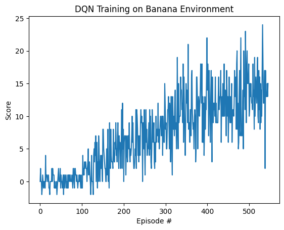

# Report | Navigation (Unity ML-Agents)

## Architecture

### Neural Network Architecture

```
Input Layer (state_size)
    ↓
Hidden Layer 1 (128 units, ReLU)
    ↓
Hidden Layer 2 (128 units, ReLU)
    ↓
Output Layer (action_size)
```

**Network Details**:
- **Input**: State vector
- **Hidden Layers**: 2 fully-connected layers with 128 units each
- **Activation**: ReLU for hidden layers, linear for output
- **Output**: Q-values for each action

### DQN Algorithm

The implementation includes:

1. **Replay Buffer**: Stores transition tuples (state, action, reward, next_state, done)
2. **Target Network**: Separate network for computing target Q-values
3. **Soft Updates**: Gradually update target network weights using parameter τ
4. **Epsilon-Greedy**: Balance exploration and exploitation during training

**Key Hyperparameters**:
```python
BUFFER_SIZE = 100,000    # Replay buffer capacity
BATCH_SIZE = 64          # Mini-batch size for training
GAMMA = 0.99             # Discount factor
TAU = 0.001              # Target network soft update rate
LR = 0.0005              # Adam optimizer learning rate
UPDATE_EVERY = 4         # Network update frequency
```

---

## Training Details

### Learning Process

**Phase 1: Exploration** (Early Episodes)
- High ε value → Agent takes random actions
- Explores environment and collects diverse experiences

**Phase 2: Learning** (Middle Episodes)
- Decreasing ε value → Shift toward learned policy
- Agent improves Q-value estimates
- Score trends upward

**Phase 3: Convergence** (Final Episodes)
- Low ε value → Agent exploits learned policy
- Stable performance on target metric
- Environment solved!

### Epsilon Decay
```python
epsilon = max(epsilon_min, epsilon * decay)
```
- Start: ε = 1.0 (full exploration)
- Decay: ε *= 0.995 per episode
- Min: ε = 0.01 (small amount of exploration)

---

## Performance Metrics

- Target: Average score ≥ 13 over 100 episodes
- Uses experience replay and target networks
- Adapts LunarLander architecture for different state/action spaces

## Results 

| Metric | Value |
|--------|-------|
| **Environment Solved** | ✓ Yes |
| **Episodes to Solve** | 546 |
| **Final Average Score** | 13.03 |
| **Best Score** | 24 |
| **Device** | Apple M3 MacBook Air |
| **Checkpoint Saved** | checkpoint.pth |



---

## 📚 Key Concepts

### Experience Replay
Stores transitions in a buffer and samples mini-batches for training, which:
- Reduces correlation between consecutive samples
- Improves sample efficiency
- Stabilizes learning

### Target Networks
Separate network for computing target Q-values:
- Reduces non-stationarity in training targets
- Updated slowly using soft updates (τ = 0.001)
- Prevents oscillations and instability

### Q-Learning Objective
```
Q(s,a) ← Q(s,a) + α[r + γ max Q(s',a') - Q(s,a)]
```
- Learn optimal action-value function Q(s, a)
- Bellman equation foundation
- Converges to optimal policy

---

## Future Enhancements

- [ ] Implement Double DQN (reduce overestimation)
- [ ] Implement Dueling DQN (separate value/advantage streams)
- [ ] Add Priority Experience Replay
- [ ] Implement Rainbow DQN (combination of improvements)
- [ ] Add policy gradient methods (A3C, PPO)
- [ ] Hyperparameter optimization with Optuna
- [ ] Parallelize training across multiple environments

---
