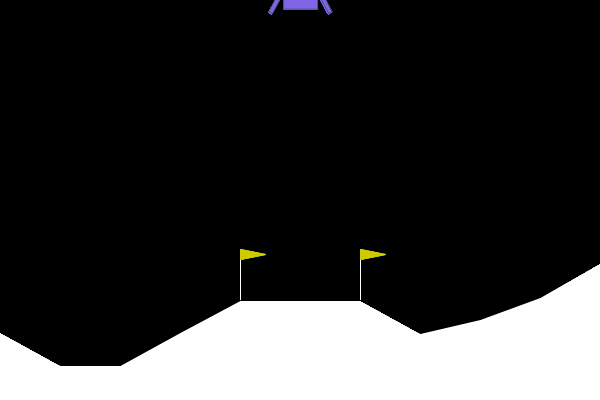

# Deep Reinforcement Learning

This repository contains implementations of **Deep Q-Network (DQN)** agents solving multiple reinforcement learning environments. These projects are part of the **Udacity Deep Reinforcement Learning Nanodegree** program.

## Projects

### 1. LunarLander-v3 (OpenAI Gymnasium)



**Problem**: Train an agent to safely land a lunar module on the landing pad with minimal fuel consumption.

### 2. Navigation (Unity ML-Agents)

**Problem**: Train an agent to navigate a 3D environment and collect yellow bananas while avoiding blue bananas.

## Hardware Acceleration

The implementations support multiple hardware backends:

```python
# Automatic device detection
if torch.backends.mps.is_available():
    device = torch.device("mps")        # Apple Silicon
elif torch.cuda.is_available():
    device = torch.device("cuda:0")     # NVIDIA GPU
else:
    device = torch.device("cpu")        # Fallback
```
## License

This project is part of the Udacity Deep Reinforcement Learning Nanodegree program.
